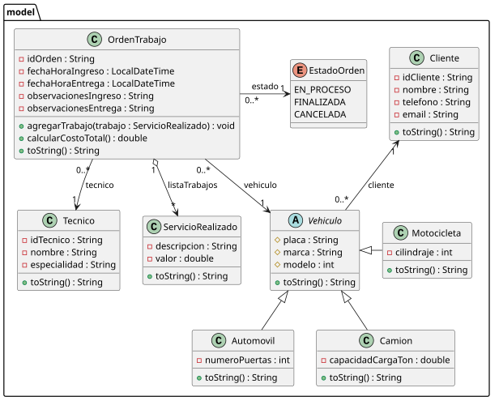
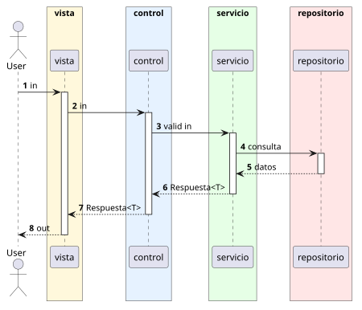

# Sistema de Gestión de Taller Mecánico (`co.edu.uptcsoft.taller`)

Proyecto desarrollado en Java aplicando una arquitectura multicapa (Vista, Control, Servicio, Repositorio y Modelo) para la administración de vehículos, clientes, técnicos y órdenes de trabajo.

---

## 🏛️ Estructura y Arquitectura

El sistema está dividido en los siguientes paquetes:

* **`co.edu.uptcsoft.taller.vista`**: Interfaz de usuario en consola (`VistaCLI`) encargada del flujo de entrada y salida (`System.out` / `System.err`)[cite: 14, 15].
* **`co.edu.uptcsoft.taller.control`**: Controladores que reciben las peticiones de la vista y delegan la ejecución[cite: 14, 15].
* **`co.edu.uptcsoft.taller.service`**: Capa de lógica de negocio que procesa las solicitudes y retorna los resultados envueltos en el record `Respuesta<T>`[cite: 14, 15].
* **`co.edu.uptcsoft.taller.repository`**: Persistencia en memoria utilizando estructuras de datos (`List<T>`) y consultas con `Optional<T>`[cite: 14, 15].
* **`co.edu.uptcsoft.taller.model`**: Entidades del dominio (`Vehiculo`, `Automovil`, `Camion`, `Motocicleta`, `Cliente`, `Tecnico`, `OrdenTrabajo`, `ServicioRealizado`, `EstadoOrden`)[cite: 1, 2, 3, 4, 5, 7, 8, 9, 10, 15].

---

## 📐 Diagramas del Proyecto

### 1. Diagrama de Clases del Modelo (Completo)
[Diagrama de Clases](src/main/java/co/edu/uptcsoft/taller/model/diagram.svg)

### 2. Diagrama de Clases del Modelo (Simplificado)

### 3. Diagrama de Flujo General de Ejecución

---

## 🚀 Ejecución del Proyecto

1. **Requisitos**: Java JDK 17 o superior.
2. **Clase Principal**: `co.edu.uptcsoft.taller.Main`[cite: 15].
